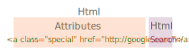
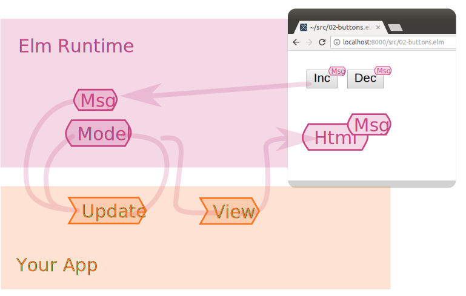
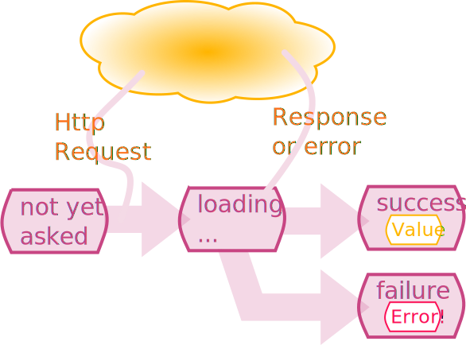
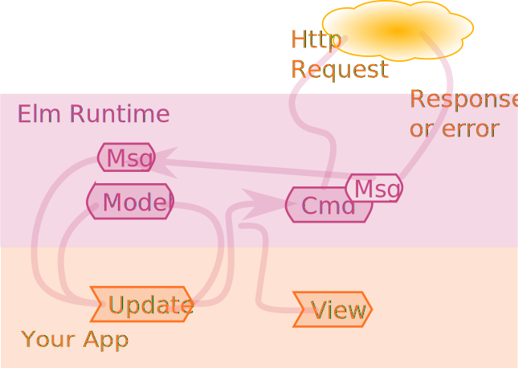

<!-- $theme: default -->

<!-- *page_number: false -->


---
<!-- page_number: true -->
# Elm for the web

Mark Skipper
mark.skipper@featurespace.co.uk
Featurespace Ltd
30 May 2018

---------------------------

# A type for DOM nodes:
elm-lang/html

```elm
type alias Html msg =
    Node msg
```

----------------------------
# Functions to create DOM nodes:



elm-lang/html
<small>


```elm
div : List (Attribute msg) -> List (Html msg) -> Html msg

text : String -> Html msg
```
</small>

---------------------------
# 1. Hello World

```elm 
main : Html msg
main =
    text "hello world"
```
---------------------------

# Buttons
elm-lang/html
<small>
```elm
button : List (Attribute msg) -> List (Html msg) -> Html msg
```
</small>
  
------------------------
# 2. Buttons

```elm
main : Html ()
main =
    div []
        [ button [ onClick () ] [ text "Inc" ]
        , button [ onClick () ] [ text "Dec" ]
    ]

```

elm-lang/Html.Events
```elm
onClick : msg -> Attribute msg
```

----------------------------

# Events and messages


----------------------------
# Programs

Elm allows `main` to be: `Html`, `Svg` or a *Program*:

```elm
type Program flags model msg
```

- `model`: The entire state of your app
- `msg`: messages from the runtime to your app
- `flags`: data passed to your app on startup

--------------------------
# Beginner program

elm-lang/html

```elm
beginnerProgram:
    { model : model
    , view : model -> Html msg
    , update : msg -> model -> model
    }
    -> Program Never model msg
```

- initial model, e.g.: `0 :Int`
- `view` renders a model as Html that might generate (`Int`) messages
- `update` takes a message and a (`Int`) model; gives a new (`Int`) model
-------------------------
# 3. Beginner program
```elm
main : Program Never Int Int
main =
  beginnerProgram
    { model = 0
    , view =
        \n ->
          div []
            [ button [ onClick 1 ] [ text "Inc" ]
            , button [ onClick -1 ] [ text "Dec" ]
            , text (toString n)
            ]
    , update = (+)
    }
```
------------------------------
# Inc, Dec and Reset

Make view a separate function
```elm
view : Model -> Html Msg
view n = ...
```
Use a custom message type:

```elm
type Msg
    = Add Int
    | Reset
```

Define an alias for Model

```elm
type alias Model = Int
```
--------------------------
# 4. Inc, Dec Reset

Define update function:
```elm
update : Msg -> Model -> Model
update msg model =
    case msg of
        Add n ->
            model + n

        Reset ->
            0
```
```elm
main : Program Never Model Msg
main =
    beginnerProgram
        { model = 0
        , view = view
        , update = update
        }
       
```
---------------------------
Don't forget the debugger

-----------------------------
## 6. Program with effects


Upgrade to `Html.Program`:
```elm
program
    :  { init : (model, Cmd msg)
       , update : msg -> model -> (model, Cmd msg)
       , subscriptions : model -> Sub msg
       , view : model -> Html msg
       }
    -> Program Never model msg
```
------------------------------
## 6. Web Data



-----------------------------
# Web data in Elm

krisajenkins/remotedata
```elm
type RemoteData e a
    = NotAsked
    | Loading
    | Failure e
    | Success a
    
type alias WebData a = 
    RemoteData Error a
```
elm-lang/http
```elm
type Error
    = BadUrl String
    | Timeout
    | NetworkError
    | BadStatus (Response String)
    | BadPayload String (Response String)
```
---------------------------
Model

```elm
type alias Model =
    WebData String

```
---------------------------
# Sending requests with Commands



-----------------------------

# Program
Like `beginerProgram`, but with Commands (and subscriptions)

elm-lang/html:

```elm
program:  
    { init : (model, Cmd msg)
    , update : msg -> model -> (model, Cmd msg)
    , subscriptions : model -> Sub msg
    , view : model -> Html msg 
    }
    -> Program Never model msg
```
------------------------------

# Init

Returns initial model **and** first command
```elm
init : ( Model, Cmd Msg )
init =
    ( RemoteData.NotAsked
    , Cmd.none
    )
```

-----------------------------

# Msg
Two messages:
```elm
type Msg
    = Request
    | Response (Result Error String) 
```

- `Request` for the button to initiate the request
- `Resoinse` brings the result

The result of an Http request is represented by `Result`:

```elm
type Result error value
    = Ok value
    | Err error
```
----------------------------
# Http requests

elm-lang/http:

```elm
getString : String -> Request String
```
Takes the url and gives an HTTP request (that will reuturn `String`) 

```elm
send : (Result Error a -> msg) -> Request a -> Cmd msg
```
Turns a `Request` into a command using a `Msg` constructor

---------------------------------
# Update
```elm
update : Msg -> Model -> ( Model, Cmd Msg )
update msg model =
    case msg of
        Request ->
            ( RemoteData.Loading
            , send Response (getString url)
            )

        Response (Ok value) ->
            ( RemoteData.Success value
            , Cmd.none
            )

        Response (Err error) ->
            ( RemoteData.Failure error
            , Cmd.none
            )
```
----------------------------

```elm
viewModel : Model -> Html Msg
viewModel webdataStrig =
    case webdataStrig of
        RemoteData.NotAsked ->
            div [] []

        RemoteData.Loading ->
            div [ style [ ( "background", "yellow" ) ] ]
                [ text "Loading ..." ]

        RemoteData.Failure err ->
            div [ style [ ( "color", "red" ) ] ]
                [ text (toString err) ]

        RemoteData.Success value ->
            div [ style [ ( "color", "grey" ) ] ]
                [ text value ]

```
------------------------------
# Elm Style Elements

- mdgriffith/style-elements
- Generates HTML *and* CSS
- Separates layout and content from styling


```elm
main : Html msg
main =
    layout
        (Style.styleSheet [])
        (text "Hello, World!")
```
-------------------------------
# Separate style and content
```elm
main =
    layout style content


style : StyleSheet class variation
style =
    Style.styleSheet []


content : Element () variation msg
content =
    text "Hello, World!"


```

------------------------------

- Elm: http://elm-lang.org/
- Book: https://www.manning.com/books/elm-in-action
- todo app: https://github.com/evancz/elm-todomvc
- Single page app: https://github.com/rtfeldman/elm-spa-example
- Remote Data http://package.elm-lang.org/packages/krisajenkins/remotedata/latest
- Style elements: http://package.elm-lang.org/packages/mdgriffith/style-elements/latest


---

